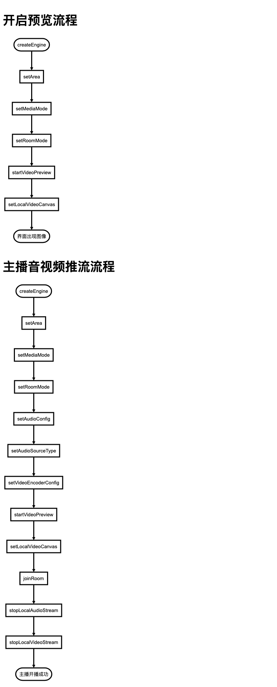

# MouseLive-android

鼠年，泛娱乐直播项目，android

# 产品概述
泛娱乐包含2大模块：直播模块和聊天室模块。
- 直播模块：可实现直播开播、多人在线观看、多人文字聊天、视频连麦、禁言、视频美颜、视频滤镜、视频贴图、手势显示等功能。
- 聊天室模块：可实现多人语音聊天、多人文字聊天、变声、抢麦、踢人等功能。

# 关键特性

# 工程介绍
此工程主要演示如何用Thunder和Hummer 2个SDK实现直播和聊天室功能，以及视频美颜功能。
- Thunder SDK：主要对音视频的控制。[在线文档](https://www.sunclouds.com/cloud/v2/developer/doc.htm?serviceId=102&typeCode=PRO_DES)
- Hummer SDK：主要是对房间类用户进出通知，以及房间类消息的传输。[在线文档](https://www.sunclouds.com/cloud/v2/developer/doc.htm?serviceId=105&typeCode=PRO_DES)
- 美颜SDK：请看 effect 下[README](./effect/README.md) 文档


# 集成
##### 1.去[尚云平台](https://www.sunclouds.com/)注册账号，并创建自己的工程项目，获取到 AppID。
##### 2.添加maven地址，在工程父目录下找到build.gradle，然后在allprojects-repositories中增加以下代码。
```
    maven { url "http://nexus.sunclouds.com:8081/nexus/content/groups/public/" }
```

##### 3.引入Thunder 和 Hummer包，在相应Module下找到build.gradle，在dependencies中增加以下代码。
```
    //ThunderBolt
    implementation "com.rtc.thunder:thunderbolt:${thunder_version}"

    //Hummer
    implementation "com.hummer.im:core:${hummer_version}"
    implementation "com.hummer.im:chatroom:${hummer_version}"
```
- 相应SDK版本

|SDK|版本|
|:----|:----|
|thunder_version|2.7.17|
|hummer_version|2.6.107|

# 开发
### 直播
- 视频功能-Thunder主要API

|API|说明|
|:----|:----|
|[createEngine](https://www.sunclouds.com/cloud/v2/developer/doc.htm?serviceId=102&typeCode=API_DOC&title=Android&version=2.7.0#createEngine) |初始化（建议只创建一次，不要创建多个），其中包括接口回调[ThunderEventHandler](https://www.sunclouds.com/cloud/v2/developer/doc.htm?serviceId=102&typeCode=API_DOC&title=Android&version=2.7.0#ThunderEventHandler%E6%8E%A5%E5%8F%A3%E7%B1%BB)。|
|[setArea](https://www.sunclouds.com/cloud/v2/developer/doc.htm?serviceId=102&typeCode=API_DOC&title=Android&version=2.7.0#setArea)|初始化-设置地区|
|[setMediaMode](https://www.sunclouds.com/cloud/v2/developer/doc.htm?serviceId=102&typeCode=API_DOC&title=Android&version=2.7.0#setMediaMode)|配置-媒体模式|
|[setRoomMode](https://www.sunclouds.com/cloud/v2/developer/doc.htm?serviceId=102&typeCode=API_DOC&title=Android&version=2.7.0#setRoomMode)|配置-房间模式|
|[setAudioConfig](https://www.sunclouds.com/cloud/v2/developer/doc.htm?serviceId=102&typeCode=API_DOC&title=Android&version=2.7.0#setAudioConfig)|配置-音频模式|
|[setAudioSourceType](https://www.sunclouds.com/cloud/v2/developer/doc.htm?serviceId=102&typeCode=API_DOC&title=Android&version=2.7.0#setAudioSourceType)|配置-音频开播模式|
|[setVideoEncoderConfig](https://www.sunclouds.com/cloud/v2/developer/doc.htm?serviceId=102&typeCode=API_DOC&title=Android&version=2.7.0#setVideoEncoderConfig)|配置-视频开播参数|
|[joinRoom](https://www.sunclouds.com/cloud/v2/developer/doc.htm?serviceId=102&typeCode=API_DOC&title=Android&version=2.7.0#joinRoom)|功能-加入房间，此接口是异步接口，需要监控ThunderEventHandler中[onJoinRoomSuccess](https://www.sunclouds.com/cloud/v2/developer/doc.htm?serviceId=102&typeCode=API_DOC&title=Android&version=2.7.0#onJoinRoomSuccess)。|
|[stopLocalAudioStream](https://www.sunclouds.com/cloud/v2/developer/doc.htm?serviceId=102&typeCode=API_DOC&title=Android&version=2.7.0#stopLocalAudioStream)|功能-音频推流开关（闭麦功能）|
|[startVideoPreview](https://www.sunclouds.com/cloud/v2/developer/doc.htm?serviceId=102&typeCode=API_DOC&title=Android&version=2.7.0#startVideoPreview)|功能-本地视频预览开关|
|[stopLocalVideoStream](https://www.sunclouds.com/cloud/v2/developer/doc.htm?serviceId=102&typeCode=API_DOC&title=Android&version=2.7.0#stopLocalVideoStream)|功能-视频推流开关|
|[setLocalVideoCanvas](https://www.sunclouds.com/cloud/v2/developer/doc.htm?serviceId=102&typeCode=API_DOC&title=Android&version=2.7.0#setLocalVideoCanvas)|功能-设置本地视图，设置此窗口，则可以看到我的视频画面|
|[setRemoteVideoCanvas](https://www.sunclouds.com/cloud/v2/developer/doc.htm?serviceId=102&typeCode=API_DOC&title=Android&version=2.7.0#setRemoteVideoCanvas)|功能-设置远端视频的渲染视图，设置此窗口，则可以看到远端订阅的对应uid的流的画面|
|[addSubscribe](https://www.sunclouds.com/cloud/v2/developer/doc.htm?serviceId=102&typeCode=API_DOC&title=Android&version=2.7.0#addSubscribe)|功能-跨房间订阅（2个主播PK功能）|
|[removeSubscribe](https://www.sunclouds.com/cloud/v2/developer/doc.htm?serviceId=102&typeCode=API_DOC&title=Android&version=2.7.0#removeSubscribe)|功能-取消跨房间订阅|
|[switchFrontCamera](https://www.sunclouds.com/cloud/v2/developer/doc.htm?serviceId=102&typeCode=API_DOC&title=Android&version=2.7.0#switchFrontCamera)|功能-切到前/后置摄像头，需要在开启预览后[startVideoPreview](https://www.sunclouds.com/cloud/v2/developer/doc.htm?serviceId=102&typeCode=API_DOC&title=Android&version=2.7.0#startVideoPreview)调用不调用该方法时引擎默认启动前置摄像头|
|[setLocalVideoMirrorMode](https://www.sunclouds.com/cloud/v2/developer/doc.htm?serviceId=102&typeCode=API_DOC&title=Android&version=2.7.0#setLocalVideoMirrorMode)|功能-设置本地视频镜像模式，只对前置摄像头生效，后置摄像头不生效，后置摄像头固定预览推流都不镜像，前置摄像头默认预览镜像推流不镜像|
|[setEnableInEarMonitor](https://www.sunclouds.com/cloud/v2/developer/doc.htm?serviceId=102&typeCode=API_DOC&title=Android&version=2.7.0#setEnableInEarMonitor)|功能-打开关闭耳返|
|[setVoiceChanger](https://www.sunclouds.com/cloud/v2/developer/doc.htm?serviceId=102&typeCode=API_DOC&title=Android&version=2.7.0#setVoiceChanger)|功能-设置变声模式|
|[leaveRoom](https://www.sunclouds.com/cloud/v2/developer/doc.htm?serviceId=102&typeCode=API_DOC&title=Android&version=2.7.0#leaveRoom)|功能-离开房间，此接口是异步接口，需要监控ThunderEventHandler中[onLeaveRoom](https://www.sunclouds.com/cloud/v2/developer/doc.htm?serviceId=102&typeCode=API_DOC&title=Android&version=2.7.0#onLeaveRoom)。|



### 聊天室
- 音频功能-Thunder主要API

|API|说明|
|:----|:----|
|[createEngine](https://www.sunclouds.com/cloud/v2/developer/doc.htm?serviceId=102&typeCode=API_DOC&title=Android&version=2.7.0#createEngine)|初始化，其中包括[ThunderEventHandler](https://www.sunclouds.com/cloud/v2/developer/doc.htm?serviceId=102&typeCode=API_DOC&title=Android&version=2.7.0#ThunderEventHandler%E6%8E%A5%E5%8F%A3%E7%B1%BB)。|
|[setArea](https://www.sunclouds.com/cloud/v2/developer/doc.htm?serviceId=102&typeCode=API_DOC&title=Android&version=2.7.0#setArea)|初始化-设置地区|
|[setMediaMode](https://www.sunclouds.com/cloud/v2/developer/doc.htm?serviceId=102&typeCode=API_DOC&title=Android&version=2.7.0#setMediaMode)|配置-媒体模式|
|[setRoomMode](https://www.sunclouds.com/cloud/v2/developer/doc.htm?serviceId=102&typeCode=API_DOC&title=Android&version=2.7.0#setRoomMode)|配置-房间模式|
|[setAudioConfig](https://www.sunclouds.com/cloud/v2/developer/doc.htm?serviceId=102&typeCode=API_DOC&title=Android&version=2.7.0#setAudioConfig)|配置-音频模式|
|[setAudioSourceType](https://www.sunclouds.com/cloud/v2/developer/doc.htm?serviceId=102&typeCode=API_DOC&title=Android&version=2.7.0#setAudioSourceType)|配置-音频开播模式|
|[joinRoom](https://www.sunclouds.com/cloud/v2/developer/doc.htm?serviceId=102&typeCode=API_DOC&title=Android&version=2.7.0#joinRoom)|功能-加入房间，此接口是异步接口，需要监控ThunderEventHandler中[onJoinRoomSuccess](https://www.sunclouds.com/cloud/v2/developer/doc.htm?serviceId=102&typeCode=API_DOC&title=Android&version=2.7.0#onJoinRoomSuccess)。|
|[stopLocalAudioStream](https://www.sunclouds.com/cloud/v2/developer/doc.htm?serviceId=102&typeCode=API_DOC&title=Android&version=2.7.0#stopLocalAudioStream)|功能-音频推流开关（闭麦功能）|
|[setEnableInEarMonitor](https://www.sunclouds.com/cloud/v2/developer/doc.htm?serviceId=102&typeCode=API_DOC&title=Android&version=2.7.0#setEnableInEarMonitor)|功能-打开关闭耳返|
|[setVoiceChanger](https://www.sunclouds.com/cloud/v2/developer/doc.htm?serviceId=102&typeCode=API_DOC&title=Android&version=2.7.0#setVoiceChanger)|功能-设置变声模式|
|[leaveRoom](https://www.sunclouds.com/cloud/v2/developer/doc.htm?serviceId=102&typeCode=API_DOC&title=Android&version=2.7.0#leaveRoom)|功能-离开房间，此接口是异步接口，需要监控ThunderEventHandler中[onLeaveRoom](https://www.sunclouds.com/cloud/v2/developer/doc.htm?serviceId=102&typeCode=API_DOC&title=Android&version=2.7.0#onLeaveRoom)。|

- 音频功能-音乐文件播放API-ThunderAudioFilePlayer

|API|说明|
|:----|:----|
|[createAudioFilePlayer](https://www.sunclouds.com/cloud/v2/developer/doc.htm?serviceId=102&typeCode=API_DOC&title=Android&version=2.7.0#ThunderAudioFilePlayer)|初始化|
|[enablePublish](https://www.sunclouds.com/cloud/v2/developer/doc.htm?serviceId=102&typeCode=API_DOC&title=Android&version=2.7.0#ThunderAudioFilePlayer)|配置-是否将当前播放的文件作为直播伴奏使用|
|[enableVolumeIndication](https://www.sunclouds.com/cloud/v2/developer/doc.htm?serviceId=102&typeCode=API_DOC&title=Android&version=2.7.0#ThunderAudioFilePlayer)|配置-打开文件播放音量回调|
|[setPlayerNotify](https://www.sunclouds.com/cloud/v2/developer/doc.htm?serviceId=102&typeCode=API_DOC&title=Android&version=2.7.0#ThunderAudioFilePlayer)|配置-播放回调接口|
|[open](https://www.sunclouds.com/cloud/v2/developer/doc.htm?serviceId=102&typeCode=API_DOC&title=Android&version=2.7.0#ThunderAudioFilePlayer)|配置-打开需要播放的文件，支持文件格式：mp3、aac、wav。此接口是异步操作，需要先设置接口回调setPlayerNotify，然后在ThunderAudioFilePlayer.IThunderAudioFilePlayerCallback中监控onAudioFilePlayError，当errorCode==0时，表示文件打开成功。|
|[getTotalPlayTimeMS](https://www.sunclouds.com/cloud/v2/developer/doc.htm?serviceId=102&typeCode=API_DOC&title=Android&version=2.7.0#ThunderAudioFilePlayer)|配置-获取文件的总播放时长，需要先open，并且onAudioFilePlayError回调成功打开之后才能获取到数据。|
|[setLooping](https://www.sunclouds.com/cloud/v2/developer/doc.htm?serviceId=102&typeCode=API_DOC&title=Android&version=2.7.0#ThunderAudioFilePlayer)|配置-设置循环播放次数|
|[play](https://www.sunclouds.com/cloud/v2/developer/doc.htm?serviceId=102&typeCode=API_DOC&title=Android&version=2.7.0#ThunderAudioFilePlayer)|功能-开始播放|
|[resume](https://www.sunclouds.com/cloud/v2/developer/doc.htm?serviceId=102&typeCode=API_DOC&title=Android&version=2.7.0#ThunderAudioFilePlayer)|功能-继续播放|
|[pause](https://www.sunclouds.com/cloud/v2/developer/doc.htm?serviceId=102&typeCode=API_DOC&title=Android&version=2.7.0#ThunderAudioFilePlayer)|功能-暂停播放|
|[stop](https://www.sunclouds.com/cloud/v2/developer/doc.htm?serviceId=102&typeCode=API_DOC&title=Android&version=2.7.0#ThunderAudioFilePlayer)|功能-停止播放|
|[setPlayVolume](https://www.sunclouds.com/cloud/v2/developer/doc.htm?serviceId=102&typeCode=API_DOC&title=Android&version=2.7.0#ThunderAudioFilePlayer)|功能-设置音量|

# 常见问题
### Q：为什么看不到对方视频？
- 检查一下AppId是否正确。
- 检查一下对方startVideoPreview和stopLocalVideoStream是否设置，值是否正确。
- 检查一下自己setRemoteVideoCanvas是否设置，并且对方uid是否正确。
- 检查一下2边房间号，如果是跨房间订阅（不同房间号），需要设置addSubscribe，并且正确的设置对方uid。

### Q：为什么听不到对方声音？
- 检查一下AppId是否正确。
- 检查一下对方stopLocalAudioStream是否设置，参数是stop，值是否正确。
- 检查一下自己手机音量，是否是静音模式。
- 检查一下2边是否joinRoom成功，并且检查是否是同一个房间号。

### Q：为什么我这边播放音乐文件，对方听不到？
- 检查一下AppId是否正确。
- 检查一下自己stopLocalAudioStream是否设置，参数是stop，值是否正确。
- 检查一下对方手机音量，是否是静音模式。
- 检查一下2边是否joinRoom成功，并且检查是否是同一个房间号。
- 检查一下自己setAudioSourceType，是否设置成THUNDER_PUBLISH_MODE_MIX。
- 检查一下自己enablePublish，是否设置成true。

### Q：为什么我收不到ThunderAudioFilePlayer.IThunderAudioFilePlayerCallback回调
- 检查一下是否设置setPlayerNotify回掉。
- 检查一下是否设置enableVolumeIndication。

### Q：为什么joinRoom一直失败？
- 检查一下AppId是否正确。
- 检查一下joinRoom返回的错误码，然后对应代码中的ThunderRet，查看具体原因。
